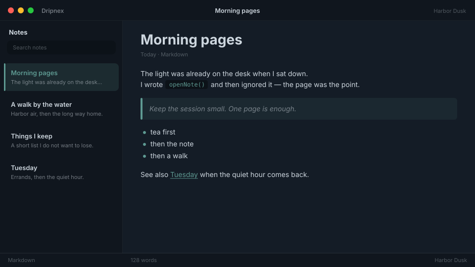

# Harbor Dusk

Coastal evening light, for when the writing stretches past sunset.



```
dripnex/theme-harbor-dusk
```

## Palette

The chips live in [palette.html](palette.html) — open it in a browser. GitHub won’t paint HTML swatches here, so the hex list is below.

| Name | Token | Color | What it’s for |
| --- | --- | --- | --- |
| Base | `--bg-base` | `#141c26` | Window background |
| Surface | `--bg-surface` | `#10161e` | Sidebar and chrome |
| Elevated | `--bg-elevated` | `#1c2633` | Raised panels |
| Text | `--text-primary` | `#cdd6de` | Headings and body |
| Muted | `--text-muted` | `#cdd6de · rgba(205, 214, 222, 0.52)` | Secondary copy |
| Accent | `--accent` | `#5e9a92` | Selection and links |
| Active | `--status-active` | `#5e9a92` | Active status |
| Dropped | `--status-dropped` | `#c46b6b` | Dropped status |

Pick it for long evening sessions by the water, when navy would feel too cold.
